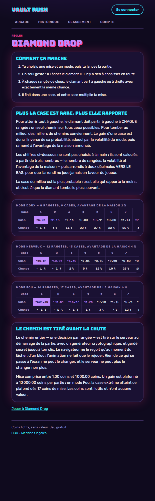

# Vault Rush

[**Jouer en ligne →**](https://vault-rush.lucasguilhot.fr) · [Étude de cas complète](https://lucasguilhot.fr/projets/vault-rush) · [Portfolio](https://lucasguilhot.fr)

`React` `TypeScript` `Express` `SQLite` `Docker`

> **Coins fictifs uniquement.** Aucun argent réel, aucun achat, aucune conversion :
> c'est une démonstration d'architecture et de logique métier, pas un produit de jeu
> d'argent.
>
> **391 tests automatisés** · **7 jeux sur un moteur commun** · **5 040 combinaisons
> énumérées** pour calibrer le jeu de code · **40 000 mains simulées** pour mesurer le
> taux de retour du blackjack.

---

Une petite arcade de **sept jeux** en **coins fictifs** : on mise, on tente sa
chance, on encaisse avant l'accident — ou on joue une main contre le croupier.
Client React, serveur Express, une seule image Docker — et tout le hasard du côté
du serveur.

<p align="center">
  
  
</p>

> Jeu gratuit, monnaie fictive, aucun achat, aucun retrait possible. Les coins
> n'ont aucune valeur.

---

## Les jeux

Sept jeux, **quatre moteurs**, rangés par genre sur l'accueil. Chaque jeu annonce
son retour au joueur (RTP) — et comment ce chiffre a été obtenu : *calculé* quand
une formule le donne exactement, *mesuré* quand il a fallu simuler.

### Monte et encaisse (moteur d'échelle, `engine/ladder.ts`)

Des étapes, des options par étape dont certaines sont sûres ; on encaisse quand on
veut. Les quatre jeux sont le **même moteur** avec d'autres paramètres.

| Jeu | Format | Modes | Options / sûres | RTP annoncé | Comment |
|---|---|---|---|---|---|
| **Vault Rush** — un étage, une porte, un coffre ou une alarme | 6 étages | Safe · Risk · Insane | 3/2 · 4/2 · 5/2 | 98 % · 96 % · 94 % | **calculé** : le multiplicateur vaut `(1 − avantage) / pⁿ`, l'avantage ne dépend donc pas de l'étape visée |
| **Laser Grid** — une ligne, une case, un passage ou un laser | 8 lignes | Calme · Tendu · Mortel | 4/3 · 4/2 · 5/2 | 98 % · 96 % · 94 % | idem, vérifié par 200 000 parties simulées à graine fixe |
| **Getaway** — un tronçon, une route, voie libre ou barrage | 5 tronçons | Tranquille · Nerveux · Cavale | 4/3 · 3/2 · 4/2 | 98 % · 96 % · 94 % | idem |
| **Bomb Squad** — une étape, un câble, neutralisé ou explosion | 4 étapes | Novice · Confirmé · Démineur | 4/3 · 4/2 · 5/2 | 98 % · 96 % · 94 % | idem |

### Réflexion (`engine/vault-code.ts`)

| Jeu | Format | Modes | RTP annoncé | Comment |
|---|---|---|---|---|
| **Vault Code** — trouve un code de 4 chiffres tous différents ; chaque essai rend des verrous (bien placés) et des échos (présents ailleurs) | 4 chiffres, 5 à 7 essais | Confort 7 · Tendu 6 · Sec 5 essais | 94,5 % · 95,0 % · 96,4 % | **mesuré par simulation** : la table de gains est calibrée contre le MEILLEUR joueur possible (minimax), en énumérant les 5 040 codes — personne ne dépasse 100 % |

### Hasard pur (`engine/drop.ts`)

| Jeu | Format | Modes | RTP annoncé | Comment |
|---|---|---|---|---|
| **Diamond Drop** — un diamant tombe de clou en clou et atterrit dans une case | 8 à 16 rangées | Doux 8 · Nerveux 12 · Fou 16 rangées | 97,65 % · 95,20 % · 93,56 % | **calculé exactement** : `Σ P(k)·mult(k)` sur la binomiale, sans aucune simulation ; l'arrondi des cases se fait vers le BAS, le RTP réel est donc un cheveu sous `1 − avantage` |

### Cartes (`engine/blackjack.ts`)

| Jeu | Format | Modes | RTP annoncé | Comment |
|---|---|---|---|---|
| **Blackjack Express** — tire ou reste, bats le croupier sans dépasser 21 ; ni séparation, ni doublement, ni assurance | contre le croupier | Express | ≈ 98,3 % | **mesuré par simulation** : 40 000 mains jouées à la stratégie de base, graine fixe (le naturel tombe à 4,90 % contre 4,83 % théoriques) |

Mise entre **1,00 et 1 000,00 coins**, gain **plafonné à 10 000,00 coins** par partie.
Chaque compte démarre à 1 000,00 coins, et sous 10,00 coins une recharge gratuite de
1 000,00 coins est offerte une fois par 24 heures. Il n'y a pas de compte de démo :
l'inscription est libre (pseudo + mot de passe) et ne demande rien d'autre.

Les captures de chaque page de règles sont dans
[`docs/design/captures/`](docs/design/captures/).

## Pourquoi le hasard est côté serveur

1. Le tirage se fait dans le serveur, avec `crypto.randomInt` — jamais dans le navigateur.
2. Il tombe **après** le choix du joueur : les options ne sont révélées qu'une fois la réponse jouée.
3. L'état de la partie (mise, étape, multiplicateur) vit en base ; le client ne fait que l'afficher.
4. Chaque coup annonce l'étape qu'il croit jouer : un double clic ou un rejeu renvoie `409 step_mismatch` sans rien changer.
5. Débit, crédit et journal passent par une transaction `BEGIN IMMEDIATE` : le solde et l'historique bougent ensemble ou pas du tout.

## Architecture

- **Serveur** : Express 4 + `node:sqlite` (aucun module natif à compiler), TypeScript
  exécuté directement par Node — pas d'étape de build côté serveur.
- **Migrations** versionnées dans `server/migrations/`, appliquées au démarrage et
  enregistrées dans `schema_migrations` ; elles ne détruisent jamais de données.
- **Argent** en centimes entiers partout (`server/src/money.ts`), jamais de flottant ;
  `"12,50"` comme `12.5` deviennent `1250`.
- **Moteurs** `server/src/engine/` : quatre moteurs (échelle, code, chute, cartes)
  derrière une seule interface `GameEngine` ; le service de partie n'en connaît
  aucun. Ajouter un jeu n'ajoute ni route, ni migration, ni ligne de service —
  voir « Ajouter un jeu » plus bas.
- **Routes génériques** `/api/games/:game/{config,start,current,play,cashout}`, plus
  compte, portefeuille, historique, classement et `/api/health`.
- **Session** : cookie `vr_session` httpOnly (JWT HS256, 30 jours), mot de passe en
  argon2id ; aucune route n'accepte d'identifiant de joueur venant du client.
- **Garde d'origine** sur toutes les mutations (CSRF), en plus du `SameSite=Lax`.
- **Client** : React 18 + Vite + react-router. Le **genre** du jeu (`config.kind`)
  choisit l'écran (`client/src/games/screens.ts`) ; le déroulé d'une partie
  (démarrage, reprise, verrou du coup en vol, fin, solde) est écrit une fois dans
  `useRound`, et la mise dans `BetForm`. Reprise d'une partie après rechargement.
- **Design** : des jetons CSS (`client/src/styles/tokens.css`) et rien d'autre — aucune
  couleur littérale dans les composants, contraste AA vérifié par un test.
- **Gardes de tests** : vocabulaire interdit dans le client (« argent réel », « retrait »,
  « dépôt », « payer », « acheter »), couleurs hors jetons, contraste, et — depuis
  qu'une fusion a laissé quatre blocs CSS ouverts sans qu'aucun test ne tombe —
  accolades CSS équilibrées et absence de marqueur de conflit dans tout le dépôt
  (`client/tests/fichiers.test.ts`).

Le détail des routes et des variables d'environnement est dans
[`server/README.md`](server/README.md) et `server/.env.example`.

## Lancer en local

Node **≥ 22.18** (Node 24 recommandé, voir `.nvmrc`) — c'est la version à partir de
laquelle `node:sqlite` et l'exécution directe du TypeScript sont disponibles sans
drapeau.

```bash
npm ci                                   # racine : installe les deux workspaces
cp server/.env.example server/.env       # puis remplacer JWT_SECRET (>= 32 caractères)
npm run dev                              # API (127.0.0.1:3001) + client (127.0.0.1:5173) dans le même terminal
# ou séparément : npm run dev:server / npm run dev:client
```

Le client de développement s'ouvre sur **`http://127.0.0.1:5173`** (jamais
`localhost` : sous Windows il se résout en IPv6 et coûte ~2,4 s par requête). Vite
relaie `/api` vers le port 3001 en gardant l'en-tête `Host` du navigateur, sans quoi
la garde d'origine refuserait les écritures.

Générer un secret de session :

```bash
node -e "console.log(require('node:crypto').randomBytes(36).toString('base64url'))"
```

En une ligne, sans fichier `.env` et sans rien écrire sur le disque :

```bash
JWT_SECRET=32-caracteres-minimum-pour-signer DB_PATH=:memory: node server/src/app.ts
```

Avec Docker (production locale : client construit, servi par Express) — mettre
`JWT_SECRET=<48 caractères>` dans un fichier `.env` à la racine, puis :

```bash
docker compose up --build                # http://127.0.0.1:3001
```

## Tests

```bash
npm run lint        # Biome (lint seul : le formatage n'est pas imposé)
npm run typecheck   # tsc sur le client et sur le serveur
npm test            # 172 tests serveur (node:test + supertest) + 219 tests client (Vitest)
npm run build       # client -> client/dist
```

Les tests serveur tournent sur une base SQLite **en mémoire**, avec du vrai HTTP et
de la vraie base : rien n'est simulé sous la couche données. Le hasard est injecté
là où le résultat doit être exact, et mesuré statistiquement là où il est le sujet.

La CI (`.github/workflows/ci.yml`) rejoue tout cela, puis construit l'image Docker,
lance le conteneur et fait une partie complète en API (`.github/scripts/smoke.sh`) :
inscription, solde de départ, mise, coup joué, encaissement, **arithmétique du solde
vérifiée**, une seule partie active, étape non rejouable, origine étrangère refusée.

## Ajouter un jeu

Le contrat d'un moteur est écrit noir sur blanc dans
**[`docs/superpowers/specs/2026-09-13-moteur-contrat.md`](docs/superpowers/specs/2026-09-13-moteur-contrat.md)** :
signature du `GameEngine`, six règles (l'état vit en base, `view` ne contient jamais
le secret, le hasard ne tombe que dans `start` et `act`…), et un moteur minimal
complet à recopier.

Ce qui est propre au jeu tient en quatre fichiers neufs — son moteur, son écran, et
leurs tests. **Mais il touche aussi une dizaine de fichiers partagés** : le contrat
en annonçait trois, les trois jeux du 13/09 en ont touché neuf de plus, toujours les
mêmes. Le compte relevé (24 à 26 fichiers par jeu) :

| Partagé | Ce qu'on y ajoute |
|---|---|
| `server/src/engine/types.ts` | son identifiant dans `GAME_IDS`, son genre dans `GameKind` |
| `server/src/engine/registry.ts` | une ligne dans `buildEngines()` |
| `client/src/games/screens.ts` | une ligne dans `SCREENS`, **et une dans `RULES`** s'il a ses propres règles |
| `client/src/games/boards/index.ts` | son accent dans `ACCENTS` et dans `BoardAccent` |
| `client/src/components/Button.tsx` | la variante de bouton à sa couleur |
| `client/src/components/{GameCard,PageTitle}.tsx` | son accent dans leur union de props |
| `client/src/styles/tokens.css` | ses jetons de couleur (et rien ailleurs) |
| `client/src/styles/components.css` | la tuile et le titre à son accent |
| `client/tests/contrast.test.ts` | le couple texte/fond de son accent |

Et deux fichiers que le contrat ne mentionnait pas non plus :

- `server/src/engine/<jeu>.ts` doit renseigner **`format`** dans sa config (« 6 étages »,
  « contre le croupier ») : l'arcade l'affiche tel quel et ne devine aucun pluriel ;
- si ses modes n'ont pas tous la même longueur, chaque mode porte son **`steps`**
  (Vault Code : 5, 6 ou 7 essais), sinon l'historique affiche le maximum du jeu.

Ce qu'un jeu ne touche **toujours pas** : aucune route, aucune migration, aucune
ligne de `games.service.ts`, de `api.ts`, de `Game.tsx` ni de la base. Et depuis le
14/09 il ne recopie plus le formulaire de mise : `client/src/games/BetForm.tsx` prend
le libellé du bouton, sa couleur, le rendu d'une puce de mode et un panneau de
récompenses facultatif (`RewardPanel`).

## Déploiement

Un VPS, un conteneur, un volume : voir **[`deploy/coolify.md`](deploy/coolify.md)**
(Hetzner + Coolify, variables à saisir, volume `/data`, domaine et HTTPS, sonde de
santé, sauvegarde du fichier SQLite, mise à jour).

## Textes légaux

Les CGU et les mentions légales sont en ligne (`/cgu`, `/mentions-legales`) et disent
noir sur blanc que le jeu est gratuit, que les coins sont fictifs et qu'aucune
transaction n'est possible. Les coordonnées de l'éditeur vivent dans
`client/src/lib/legal.ts` et portent encore des **« À COMPLÉTER »** : ils doivent être
remplis avant toute mise en ligne publique — et ils se voient à l'écran tant qu'ils
ne le sont pas.

## Feuille de route

Le détail est dans [`docs/PROPOSITIONS-AMELIORATIONS.md`](docs/PROPOSITIONS-AMELIORATIONS.md)
(et le cahier d'origine dans [`docs/vault_rush_plan.md`](docs/vault_rush_plan.md)) :

- ~~Getaway~~, ~~Bomb Squad~~, ~~Vault Code~~, ~~Diamond Drop~~, ~~Blackjack~~ : **livrés**.
- Safecracker, Heist Crew : le socle multi-moteurs en absorbe déjà l'essentiel.
- **Progression commune** : niveaux, missions, succès, cosmétiques — hors périmètre de
  cette refonte, volontairement.
- Bonus de partie (scanner, bouclier, double vault, porte dorée) et objectifs de partie.

## Crédits

Conception et développement : **Lucas Guilhot**. Refonte menée avec Claude Code
(spécification, plan et rapports dans `docs/superpowers/`). L'audit du MVP d'origine
est dans `audit/AUDIT-REFONTE.md`.
