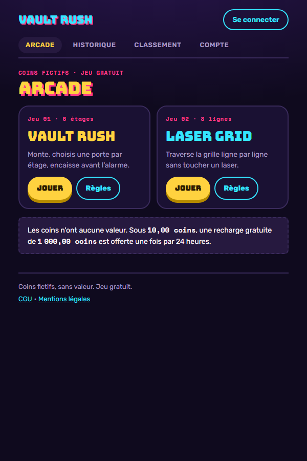
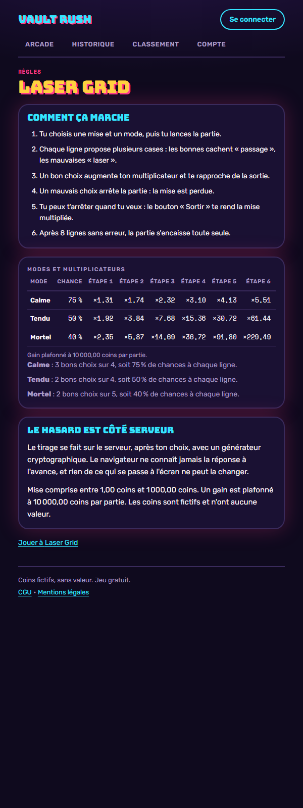

# Vault Rush

Une petite arcade de jeux de risque en **coins fictifs** : on mise, on monte étape
par étape, on encaisse avant l'accident. Client React, serveur Express, une seule
image Docker — et tout le hasard du côté du serveur.

<p align="center">
  
  
</p>

> Jeu gratuit, monnaie fictive, aucun achat, aucun retrait possible. Les coins
> n'ont aucune valeur.

---

## Les jeux

Les deux jeux sont le **même moteur** avec d'autres paramètres : des étapes, des
options par étape, dont certaines sont sûres.

| Jeu | Étapes | Modes | Options / sûres | Avantage de la maison |
|---|---|---|---|---|
| **Vault Rush** — un étage, une porte, un coffre ou une alarme | 6 étages | Safe · Risk · Insane | 3/2 · 4/2 · 5/2 | 2 % · 4 % · 6 % |
| **Laser Grid** — une ligne, une case, un passage ou un laser | 8 lignes | Calme · Tendu · Mortel | 4/3 · 4/2 · 5/2 | 2 % · 4 % · 6 % |

Le multiplicateur de l'étape `n` vaut `(1 − avantage) / p^n`, où `p` est la
probabilité de réussir une étape (options sûres ÷ options). L'avantage de la maison
est donc le même quelle que soit l'étape visée : s'arrêter tôt ou aller au bout ne
change pas l'espérance, seulement la variance. Réussir la dernière étape encaisse
automatiquement.

Mise entre **1,00 et 1 000,00 coins**, gain **plafonné à 10 000,00 coins** par partie.
Chaque compte démarre à 1 000,00 coins, et sous 10,00 coins une recharge gratuite de
1 000,00 coins est offerte une fois par 24 heures. Il n'y a pas de compte de démo :
l'inscription est libre (pseudo + mot de passe) et ne demande rien d'autre.

## Pourquoi le hasard est côté serveur

1. Le tirage se fait dans le serveur, avec `crypto.randomInt` — jamais dans le navigateur.
2. Il tombe **après** le choix du joueur : les options ne sont révélées qu'une fois la réponse jouée.
3. L'état de la partie (mise, étape, multiplicateur) vit en base ; le client ne fait que l'afficher.
4. Chaque coup annonce l'étape qu'il croit jouer : un double clic ou un rejeu renvoie `409 step_mismatch` sans rien changer.
5. Débit, crédit et journal passent par une transaction `BEGIN IMMEDIATE` : le solde et l'historique bougent ensemble ou pas du tout.

## Architecture

- **Serveur** : Express 4 + `node:sqlite` (aucun module natif à compiler), TypeScript
  exécuté directement par Node — pas d'étape de build côté serveur.
- **Migrations** versionnées dans `server/migrations/`, appliquées au démarrage et
  enregistrées dans `schema_migrations` ; elles ne détruisent jamais de données.
- **Argent** en centimes entiers partout (`server/src/money.ts`), jamais de flottant ;
  `"12,50"` comme `12.5` deviennent `1250`.
- **Moteur** `server/src/engine/` : une `GameDefinition` décrit un jeu (étapes, modes,
  libellés) ; ajouter un jeu n'ajoute ni route ni écran.
- **Routes génériques** `/api/games/:game/{config,start,current,play,cashout}`, plus
  compte, portefeuille, historique, classement et `/api/health`.
- **Session** : cookie `vr_session` httpOnly (JWT HS256, 30 jours), mot de passe en
  argon2id ; aucune route n'accepte d'identifiant de joueur venant du client.
- **Garde d'origine** sur toutes les mutations (CSRF), en plus du `SameSite=Lax`.
- **Client** : React 18 + Vite + react-router, un écran de jeu **générique** piloté par
  la config renvoyée par le serveur ; reprise d'une partie après un rechargement.
- **Design** : des jetons CSS (`client/src/styles/tokens.css`) et rien d'autre — aucune
  couleur littérale dans les composants, contraste AA vérifié par un test.
- **Gardes de tests** : vocabulaire interdit dans le client (« argent réel », « retrait »,
  « dépôt », « payer », « acheter »), couleurs hors jetons, contraste.

Le détail des routes et des variables d'environnement est dans
[`server/README.md`](server/README.md) et `server/.env.example`.

## Lancer en local

Node **≥ 22.18** (Node 24 recommandé, voir `.nvmrc`) — c'est la version à partir de
laquelle `node:sqlite` et l'exécution directe du TypeScript sont disponibles sans
drapeau.

```bash
npm ci                                   # racine : installe les deux workspaces
cp server/.env.example server/.env       # puis remplacer JWT_SECRET (>= 32 caractères)
npm run dev                              # l'API sur http://127.0.0.1:3001
npm run dev:client                       # dans un second terminal : http://127.0.0.1:5173
```

Le client de développement s'ouvre sur **`http://127.0.0.1:5173`** (jamais
`localhost` : sous Windows il se résout en IPv6 et coûte ~2,4 s par requête). Vite
relaie `/api` vers le port 3001 en gardant l'en-tête `Host` du navigateur, sans quoi
la garde d'origine refuserait les écritures.

Générer un secret de session :

```bash
node -e "console.log(require('node:crypto').randomBytes(36).toString('base64url'))"
```

En une ligne, sans fichier `.env` et sans rien écrire sur le disque :

```bash
JWT_SECRET=32-caracteres-minimum-pour-signer DB_PATH=:memory: node server/src/app.ts
```

Avec Docker (production locale : client construit, servi par Express) — mettre
`JWT_SECRET=<48 caractères>` dans un fichier `.env` à la racine, puis :

```bash
docker compose up --build                # http://127.0.0.1:3001
```

## Tests

```bash
npm run lint        # Biome (lint seul : le formatage n'est pas imposé)
npm run typecheck   # tsc sur le client et sur le serveur
npm test            # 78 tests serveur (node:test + supertest) + 114 tests client (Vitest)
npm run build       # client -> client/dist
```

Les tests serveur tournent sur une base SQLite **en mémoire**, avec du vrai HTTP et
de la vraie base : rien n'est simulé sous la couche données. Le hasard est injecté
là où le résultat doit être exact, et mesuré statistiquement là où il est le sujet.

La CI (`.github/workflows/ci.yml`) rejoue tout cela, puis construit l'image Docker,
lance le conteneur et fait une partie complète en API (`.github/scripts/smoke.sh`) :
inscription, solde de départ, mise, coup joué, encaissement, **arithmétique du solde
vérifiée**, une seule partie active, étape non rejouable, origine étrangère refusée.

## Déploiement

Un VPS, un conteneur, un volume : voir **[`deploy/coolify.md`](deploy/coolify.md)**
(Hetzner + Coolify, variables à saisir, volume `/data`, domaine et HTTPS, sonde de
santé, sauvegarde du fichier SQLite, mise à jour).

## Textes légaux

Les CGU et les mentions légales sont en ligne (`/cgu`, `/mentions-legales`) et disent
noir sur blanc que le jeu est gratuit, que les coins sont fictifs et qu'aucune
transaction n'est possible. Les coordonnées de l'éditeur vivent dans
`client/src/lib/legal.ts` et portent encore des **« À COMPLÉTER »** : ils doivent être
remplis avant toute mise en ligne publique — et ils se voient à l'écran tant qu'ils
ne le sont pas.

## Feuille de route

Le détail est dans [`docs/PROPOSITIONS-AMELIORATIONS.md`](docs/PROPOSITIONS-AMELIORATIONS.md)
(et le cahier d'origine dans [`docs/vault_rush_plan.md`](docs/vault_rush_plan.md)) :

- **Getaway** — la fuite : accélérer ou se ranger, même logique d'encaissement.
- **Vault Code** — plus de réflexion que de hasard (déduction d'un code).
- Bomb Squad, Diamond Drop, Safecracker, Heist Crew : le moteur en absorbe déjà une partie.
- **Progression commune** : niveaux, missions, succès, cosmétiques — hors périmètre de
  cette refonte, volontairement.
- Bonus de partie (scanner, bouclier, double vault, porte dorée) et objectifs de partie.

## Crédits

Conception et développement : **Lucas Guilhot**. Refonte menée avec Claude Code
(spécification, plan et rapports dans `docs/superpowers/`). L'audit du MVP d'origine
est dans `audit/AUDIT-REFONTE.md`.
