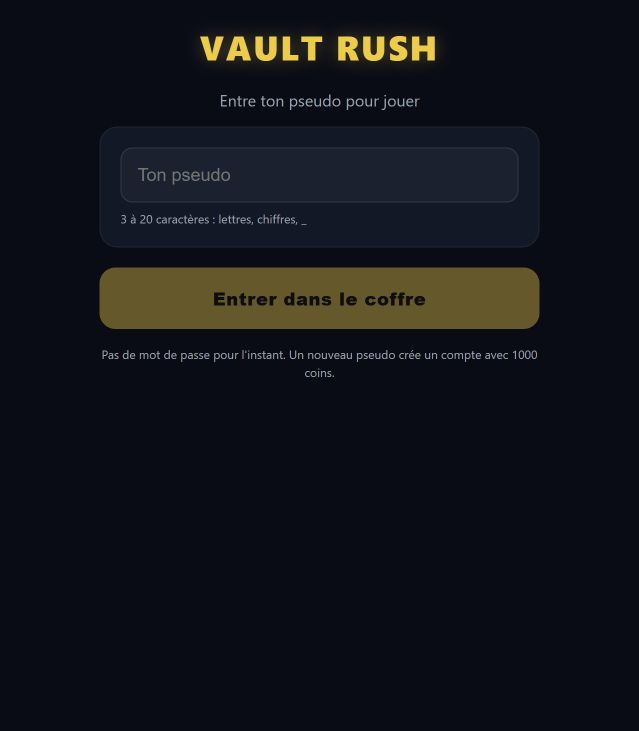
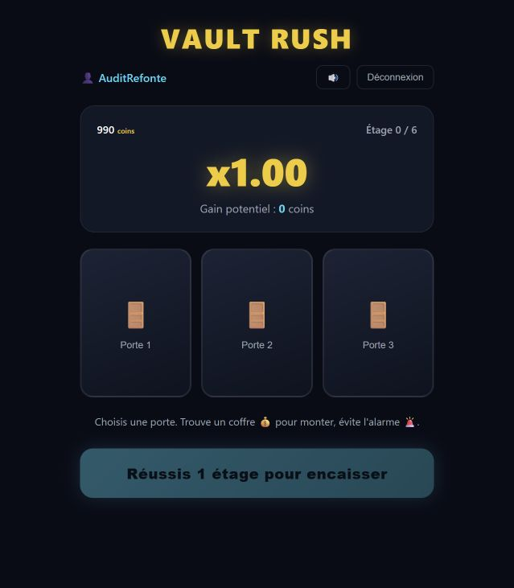
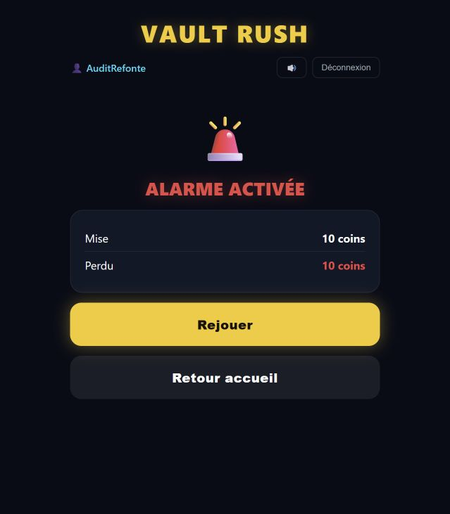
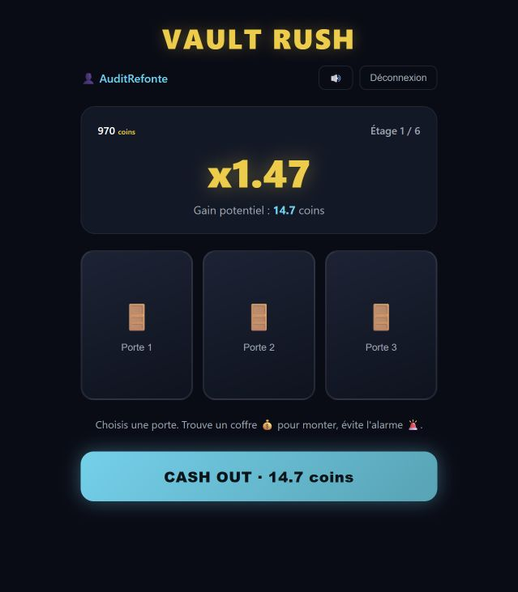
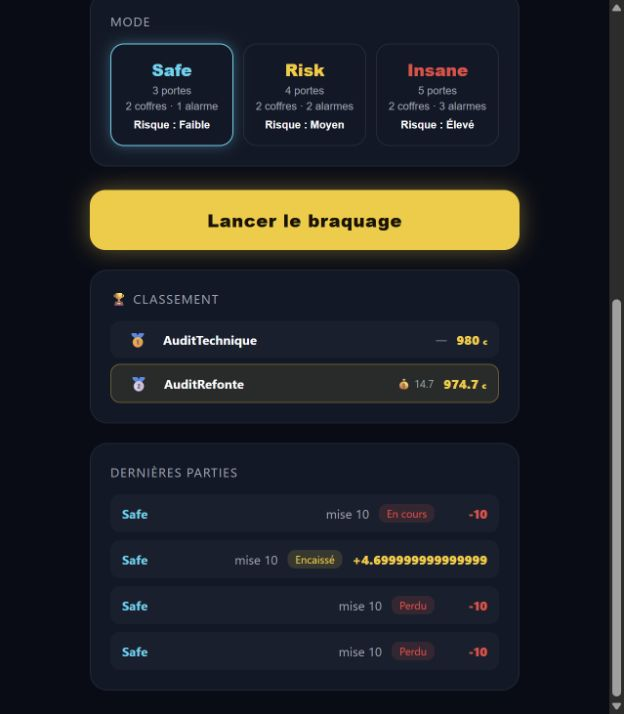

# Audit préalable à la refonte — Vault Rush

12 septembre 2026. Audit du code local et du parcours exécuté dans le navigateur intégré, avec une base SQLite de test séparée (`audit/test-vault.db`). Aucun fichier applicatif modifié et aucune donnée de `server/data` utilisée pour les essais.

## Verdict

Un MVP jouable et assez simple pour évoluer sans réécriture complète. La palette sombre/or/cyan, les boutons visibles et la séparation frontend/backend constituent une bonne base. La refonte doit toutefois couvrir la fiabilité des parties, la compréhension des règles et l'identité visuelle : changer uniquement les couleurs laisserait les principaux défauts en place.

## Parcours observé

| Étape | État | Constat |
|---|---|---|
| 1. Entrée par pseudo | Fonctionnelle, confiance fragile | Entrée rapide mais aucun aperçu du jeu avant la connexion ; le pseudo seul redonne accès au compte. |
| 2. Mise et mode | Fonctionnelle, informations incomplètes | Boutons rapides et risques lisibles ; absence de tableau des multiplicateurs et de règle du plafond. |
| 3. Choix d'une porte | Fonctionnelle, progression peu expliquée | Solde, étage et multiplicateur visibles ; mise et mode disparaissent, prochain gain absent. |
| 4. Perte puis Rejouer | Fonctionnelle en cas normal, erreurs mal couvertes | Perte explicite ; le code ne protège pas Rejouer pendant une requête et n'affiche pas ses erreurs. |
| 5. Encaissement et gain | Fonctionnelle, bilan incomplet | 10 coins à x1,47 donnent 14,7 coins ; bénéfice net et nouveau solde absents du résultat. |
| 6. Rechargement et historique | Défaillante | Partie encore « En cours », mise débitée, aucune reprise ; bénéfice affiché avec trop de décimales. |

### 1 — Entrée

Le bouton principal se distingue nettement. Ajouter une phrase expliquant « 6 étages, des portes, encaisser ou continuer » et préciser la monnaie fictive. Le champ pseudo n'a pas de label associé dans le code ; son placeholder ne remplace pas un intitulé permanent.

### 2 — Choix de la mise et du mode

La mise par défaut est 10 coins et les raccourcis vont de 1 à 100. Les modes indiquent portes, coffres et alarmes. Les informations de mode sont petites (11 px dans la feuille CSS). La sélection repose visuellement sur une bordure lumineuse ; aucun état `aria-pressed` ou radio n'est exposé.

Les essais de capture sous dimensions imposées ont produit une mise à l'échelle incohérente dans l'outil : `02-accueil-desktop.png` et `03-accueil-mobile.png` sont exclus des preuves visuelles. Le responsive nécessite une validation complémentaire sur de vrais formats mobile et desktop. Le CSS confirme néanmoins une seule colonne sous 900 px et deux colonnes pour l'accueil au-dessus.

### 3 — Partie

Les portes sont de grands boutons et la consigne est courte. L'identité de braquage repose surtout sur des emojis de portes : peu de décor ou de représentation des six étages. « Étage 0 / 6 » peut être interprété comme une étape supplémentaire. Afficher « Choisis une porte — étage 1 » et une progression des étages réussis clarifierait la situation.

### 4 — Perte

La perte est exprimée par le texte autant que par le rouge. Le résultat répète la mise sans montrer le solde restant. Rejouer devrait annoncer la mise et le mode repris, afficher un chargement et laisser une erreur compréhensible si le solde ne suffit plus.

### 5 — Encaissement

L'action d'encaisser est bien visible. « Gain 14.7 coins » inclut la mise : afficher séparément « Montant récupéré 14,70 », « Bénéfice +4,70 » et le nouveau solde. Une présentation française uniforme des nombres éviterait les variations.

### 6 — Rechargement et historique

Reproduction : lancer une partie de 10 coins, recharger la page. L'accueil revient avec 974,7 coins ; la partie figure « En cours » sans bouton de reprise. Cette ligne est rouge et porte déjà -10 comme une perte finalisée. Une partie encaissée affiche `+4.699999999999999` au lieu de `+4,70`.

## Défauts prioritaires

### P1 — Reprise des parties et fiabilité des actions

**Confirmé à l'écran et par API.** `client/src/hooks/useGame.ts:43` recrée un état home ; seuls le solde et l'historique sont rechargés. L'API autorise deux démarrages successifs : deux réponses 200 et deux débits de 10 coins. Prévoir une partie active récupérable, un démarrage idempotent et une règle explicite pour les parties abandonnées. Cela couvre aussi la fermeture d'onglet et la déconnexion pendant une partie.

### P1 — Identité du joueur

**Confirmé par lecture et appel API sur compte de test.** `server/src/modules/user/user.service.ts:25` retourne le compte existant au simple envoi de son pseudo. Les actions prennent un `userId` fourni par le client ; vérifier que la partie appartient à cet identifiant n'authentifie pas l'appelant. Avant de partager le jeu avec de vrais comptes persistants, choisir une session invitée privée ou une authentification réelle. Ce constat ponctuel ne constitue pas un audit de sécurité exhaustif.

### P1 — Écritures de base non atomiques

**Anomalie reproduite.** Une mise API de 0,001 passe la validation, est arrondie à zéro, crée une partie, puis le débit échoue avec HTTP 500. L'historique contient ensuite cette partie à mise nulle. Les opérations création/débit/journal, ainsi que clôture/crédit/journal, ne sont pas regroupées dans une transaction SQL. Valider après normalisation, stocker les montants en unités entières et rendre chaque opération atomique. Sources : `server/src/modules/game/game.service.ts:50` et `:140`, wallet et store.

### P1 — États limites du frontend

**Établi par lecture, pas tous reproduits visuellement.** `client/src/screens/Result.tsx:38` ne désactive pas Rejouer pendant le chargement et ne rend pas `state.error`. Au sixième étage, `Playing.tsx:63` laisse les portes actives alors que l'algorithme refuse toute progression supplémentaire. Ajouter un état de fin de tour explicite, une action d'encaissement et des erreurs visibles. Ne pas déclencher le son de gain avant confirmation API.

### P1 avant déploiement — Adresse API locale

`client/src/api.ts:6` fixe `http://localhost:3001/api`. Hors du poste local, cette adresse désigne la machine du visiteur. Prévoir une URL configurable ou une API sous le même domaine et documenter le lancement.

### P2 — Transparence des règles et affichage des montants

Le serveur plafonne les gains à 10 000 coins (`game.algorithm.ts:22`), sans explication dans l'interface. Le multiplicateur affiché peut donc ne plus correspondre au montant effectivement payé pour une grosse mise. Afficher le plafond, les gains par étage et les chances par mode avant de démarrer. Corriger l'arrondi dans `client/src/components/History.tsx:28` et distinguer les tours ouverts des pertes.

### P2 — Accessibilité et erreurs

Ajouter labels associés, état accessible des sélections, libellés explicites pour +/− et le son, annonces des erreurs/résultats, gestion du focus après changement d'écran et préférence de réduction des animations. Les erreurs de chargement du solde, de l'historique et du classement sont silencieuses. Une porte API invalide (99) renvoie HTTP 500 au lieu d'une erreur de validation exploitable. Vérification clavier, lecteur d'écran et mesures de contraste restent à faire ; aucune conformité annoncée.

## Base technique à conserver

- React 18 + TypeScript + Vite, composants courts, hook central et client API séparé.
- Express avec contrôleurs/services et SQLite persistante. Le calcul des résultats reste au serveur.
- Tirage via `crypto.randomInt`, contrôles du statut d'une partie et des fonds, requêtes SQL paramétrées.
- Variables CSS existantes et palette reconnaissable.

## Vérifications exécutées et limites

- `client : npm run build` : réussi ; JavaScript produit d'environ 156 ko, 50 ko gzip. Ceci n'est pas une mesure de performance utilisateur.
- `server : npm test` : 5/5 tests réussis, principalement algorithme et simulation. Pas de tests de parcours ou d'intégration wallet dans les fichiers présents.
- Parcours manuel : pseudo, mise, départ, perte, rejouer, réussite d'un étage, encaissement, rechargement et historique.
- API sur base isolée : identité par pseudo, démarrages multiples, mise inférieure au centième, porte invalide.
- Aucun test de charge, scan de dépendances, audit juridique ou audit de sécurité exhaustif. Six étages complets et panne réseau non parcourus à l'écran.
- Pas de dépôt Git détecté dans le dossier ; pas de README de démarrage identifié. Le document `vault_rush_plan.md` contient des exemples anciens à réaligner avec le comportement final.

## Ordre proposé pour la refonte

1. **Fiabiliser le socle** : sessions, transactions SQL, reprise, répétition de requêtes, fin du sixième étage, erreurs et montants. Valider avec des tests d'intégration ciblés.
2. **Clarifier le parcours** : règles visibles avant de miser, choix du risque, aperçu des gains, progression, encaissement et bilan net. Traiter aussi solde insuffisant et chargement.
3. **Dessiner l'identité** : conserver l'univers coffre/braquage, remplacer les emojis centraux par des assets cohérents, améliorer typographie et hiérarchie, représenter les six étages. Composer une vraie zone de jeu desktop et une version mobile lisible.
4. **Vérifier avant livraison** : formats mobile/desktop, clavier, lecteurs d'écran, réseau lent, rechargement en partie, clics répétés et plafond de gain.

La prochaine étape utile est une maquette du parcours principal intégrant ces corrections, avant de modifier l'interface.
